This file, reencode.sh, is a comprehensive Bash script designed to batch re-encode MKV video files for Plex, with a strong focus on:

- Preserving HDR video metadata and compatibility.
- Normalizing audio (AC3) using EBU R128 loudness standards, with optional two-pass normalization for better accuracy.
- Efficient parallel processing (up to 4 simultaneous jobs by default).
- Detailed progress reporting with a colorized progress bar.
- Robust error handling and clean resource management.

**Key Features:**

1. **Batch Processing:**  
   You can provide individual MKV files or an entire directory. The script will find all .mkv files and process them.

2. **HDR Handling:**  
   The script uses ffprobe to detect HDR and video color characteristics, passing the correct parameters to ffmpeg so HDR metadata is preserved in the output.

3. **Audio Normalization:**  
   By default, it normalizes audio in a single pass. With the --two-pass flag, it runs a two-pass normalization for more precise loudness adjustment. The normalized track is encoded as AC3 at 640kbps.

4. **Parallelism with Semaphore:**  
   Up to 4 files are processed at once (configurable via MAX_JOBS). The script uses a FIFO-based semaphore to manage concurrency safely.

5. **Progress Reporting:**  
   It creates named pipes to collect progress from ffmpeg for each job and displays a live, colorized progress bar with spinner, showing completed, in-progress, queued, and finished files.

6. **Graceful Shutdown & Cleanup:**  
   Handles interrupts (Ctrl+C) and ensures all child processes are terminated, pipes and temp files are cleaned, and no jobs are left hanging.

7. **Dependency Checks:**  
   Requires ffmpeg, ffprobe, and jq (for JSON parsing).

8. **Command-Line Usage:**  
   ```
   ./reencode.sh [--two-pass] file1.mkv file2.mkv ...
   ./reencode.sh [--two-pass] /path/to/directory/
   ```

**Typical Workflow:**
- You call the script with MKV files or a directory.
- It checks for dependencies.
- It expands the file list, calculates total duration, and initializes semaphores.
- For each file, it determines HDR and audio parameters, then calls ffmpeg to re-encode.
- Progress for each file is tracked and shown in real time.
- It cleans up all resources, even on interruption.

**Who is it for?**
- Users who want an easy way to prepare large libraries of MKV files for Plex, especially with HDR content and normalized audio.
- Anyone needing a robust, parallel, and automated video batch processor with safe shutdown and progress reporting.



**How it works:**

1. **Main Script**
   Launches multiple ffmpeg jobs in parallel (up to MAX_JOBS).
   For each input file, creates a named FIFO (progress.XYZ) for ffmpeg's progress output.

2. **ffmpeg Jobs**
   Each ffmpeg process encodes a file and outputs progress info (with -progress <fifo>) to its unique FIFO.

3. **Monitor Processes**
   For each ffmpeg job, a monitor process reads from the respective FIFO.
   It parses the progress and writes standardized lines (time, status, filename) to the global status FIFO.

4. **Global FIFO (status)**
   All monitor processes write to a single status FIFO (status.XXXXXX).

5. **Progress Bar Printer**
   The main script runs a background process that reads from the global status FIFO.
   It aggregates progress across all files and updates a single, global progress bar in the terminal.

**Summary:**
- Each ffmpeg job has its own progress FIFO and monitor.
- All monitors feed updates into a single global FIFO.
- The progress bar printer reads the global FIFO and updates the terminal.
